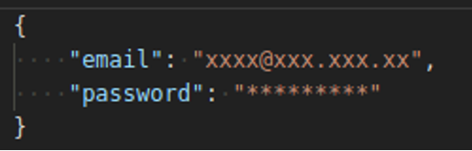
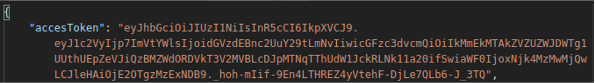

.. autosummary::
   :toctree: generated

.. _objetivo:
1.	Objetivo
^^^^^^^^^^^^^^^^^^^^^^^^

Describir de manera técnica y detallada el consumo de los servicios de IDENTY. 

.. _usuarioContrasena:
2.	Usuario y contraseña
^^^^^^^^^^^^^^^^^^^^^^^^

 Para poder consumir los servicios y generar un token es necesario solicitar un usuario y una contraseña. 
 
.. _endpointLogin:
3. Endpoint Login
^^^^^^^^^^^^^^^^^^^^^^^^

Todas las operaciones POST deben consumir un token el cual será generado a través del servicio login (ingresando usuario y contraseña previamente solicitados) y este debe ser ingresado al momento de consumir cada servicio.

AMBIENTE: Producción  

URL Servicio: https://cotejoselfie-core.gse.com.co/BackLogin/users/login

.. _parametrosDeEntrada:
3.1. Parámetros de entrada
=================

Objeto JSON que debe cumplir con los siguientes atributos:

+------------+--------+--------+-------------+---------------------------------------------------+
| Nombre     | Tipo   | Tamaño | Obligatorio | Descripción                                       |
+============+========+========+=============+===================================================+
| email      | string | 30     | si          | Usuario para el acceso a Identy entregado por GSE |
+------------+--------+--------+-------------+---------------------------------------------------+
| password   | string | 30     | si          | Clave del usuario para el acceso a GSE            |
+------------+--------+--------+-------------+---------------------------------------------------+
   
.. _jsonEntrada:
3.2     Ejemplo JSON de entrada
=================

.. _respuestaLogin:
3.3      Respuesta 
=================

Como respuesta de la operación se va a devolver un (Código 200 - Inicio de Sesión Exitoso) un JSON con la siguiente estructura:

+---------------+--------+---------+---------------------------------+
| Nombre        | Tipo   | Tamaño  | Descripción                     |
+===============+========+=========+=================================+
| accessToken   | string |         | Cadena con el token de tipo JWT |
+---------------+--------+---------+---------------------------------+

.. _jsonRespuesta:
3.4.      Ejemplo JSON de respuesta 
=================

El siguiente es un ejemplo JSON con el formato token de un response: 

