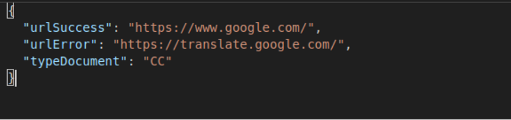
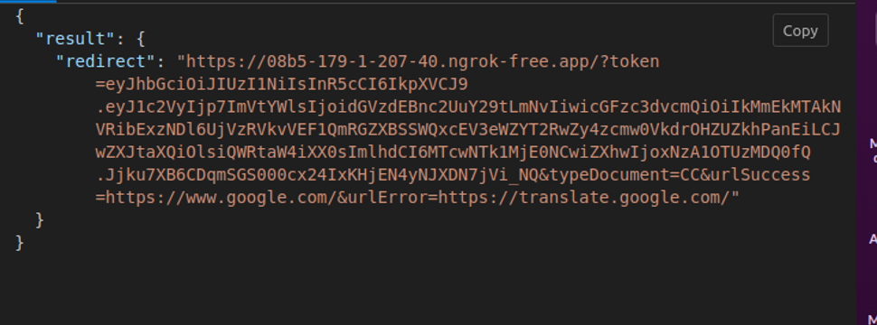

.. autosummary::
   :toctree: generated

.. _endpointManagmentUrl:
4.	Endpoint de obtención de la url 
^^^^^^^^^^^^^^^^^^^^^^^^

Operación POST que genera la url para redirección e inicio del flujo del cotejo de validación facial contra documento de identidad.

**AMBIENTE: Producción**  

**URL Servicio:** https://cotejoselfie-core.gse.com.co/BackLogin/management/url

.. _parametrosDeEntrada2:
4.1. Parámetros de entrada
=================

Objeto JSON que debe cumplir con los siguientes atributos:

+----------------+--------+--------+-------------+--------------------------------------------------------------------------+
| Nombre         | Tipo   | Tamaño | Obligatorio | Descripción                                                              |
+================+========+========+=============+==========================================================================+
| urlSuccess     | string | 30     | si          | Url de redirección para cuando el proceso ha-ya finalizado exitosa-mente |
+----------------+--------+--------+-------------+--------------------------------------------------------------------------+
| urlError       | string | 30     | si          | Url de redirección para cuando la validación de identidad sea errónea    |
+----------------+--------+--------+-------------+--------------------------------------------------------------------------+
| typeDocument   | string | 30     | si          | Tipo de documento del usuario: tipos de do-cumentos validos: CC, CE, PA  |
+----------------+--------+--------+-------------+--------------------------------------------------------------------------+
   
.. _jsonEntrada2:
4.2     Ejemplo JSON de entrada
=================

.. _respuestaUrl2:
4.3      Respuesta 
=================

Como respuesta de la operación se va a devolver un (Código 200 - Redirección Exitosa) un JSON con la siguiente estructura:

+---------------+--------+---------+----------------------------------------------------------------------+
| Nombre        | Tipo   | Tamaño  | Descripción                                                          |
+===============+========+=========+======================================================================+
| result        | Object |         | Resultado de la genera-ción de la url                                |
+---------------+--------+---------+----------------------------------------------------------------------+
| redirect      | String |   max   | Url para consumo del servicio de cotejo de vali-dación de identidad. |
+---------------+--------+---------+----------------------------------------------------------------------+

.. _jsonRespuesta2:
4.4.      Ejemplo JSON de respuesta 
=================

El siguiente es un ejemplo JSON con el formato token de un response: 

