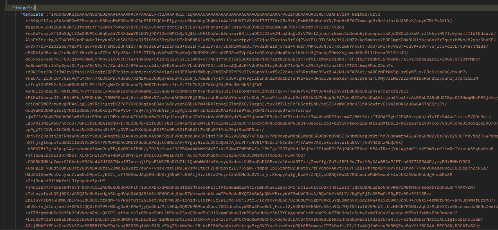
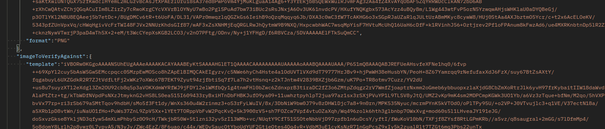
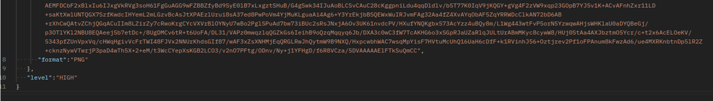
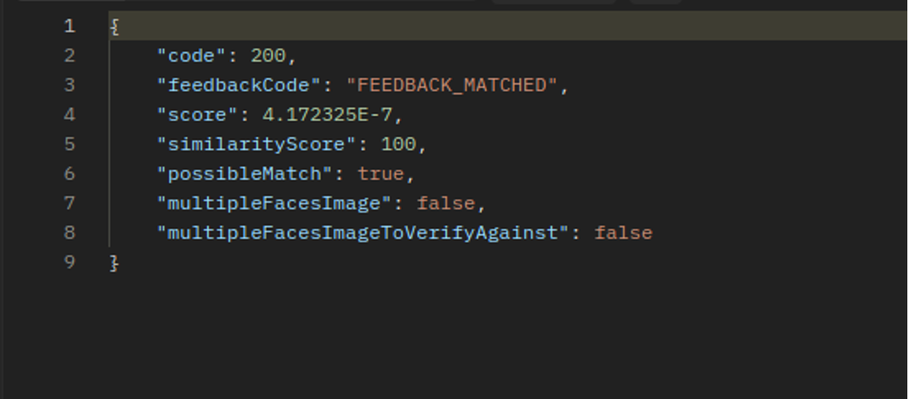

.. autosummary::
   :toctree: generated

.. _endpointMatch:
5.	Endpoint de match 
^^^^^^^^^^^^^^^^^^^^^^^^

Operación POST que hace la comparación de la imagen del documento de identidad, con-tra la imagen selfie.

**AMBIENTE: Producción**  

**URL Servicio:** https://qa-identy-web-api.gse.com.co/api/v1/matchWithSelfie

.. _parametrosDeEntrada3:
5.1. Parámetros de entrada
^^^^^^^^^^^^^^^^^^^^^^^^^^

Objeto JSON que debe cumplir con los siguientes atributos:

+----------------------+--------+--------+-------------+-----------------------------------------------------------------------------------------------------------+
| Nombre               | Tipo   | Tamaño | Obligatorio | Descripción                                                                                               |
+======================+========+========+=============+===========================================================================================================+
| image                | Object |        | si          | Es un objeto tomado desde la captura al do-cumento de identidad                                           |
+----------------------+--------+--------+-------------+-----------------------------------------------------------------------------------------------------------+
| template             | string |   max  | si          | Es la imagen tomada en base64                                                                             |
+----------------------+--------+--------+-------------+-----------------------------------------------------------------------------------------------------------+
| format               | string |    2   | si          | Es la extensión de la imagen que se envía, preferiblemente png.                                           |
+----------------------+--------+--------+-------------+-----------------------------------------------------------------------------------------------------------+
|imageToVerifyA-gainst | Object |        | si          | Es un objeto tomado desde la captura selfie del usuario.                                                  |
+----------------------+--------+--------+-------------+-----------------------------------------------------------------------------------------------------------+
| format               | enum   | 2      | si          | Es la extensión de la imagen que se envía, preferiblemente png.                                           |
+----------------------+--------+--------+-------------+-----------------------------------------------------------------------------------------------------------+
| level                | enum   | 3      | si          | Es un string que puede variar entre high, me-dium, low correspon de al nivel de seguri-dad o restricción. |
+----------------------+--------+--------+-------------+-----------------------------------------------------------------------------------------------------------+

.. _jsonEntrada3:
5.2     Ejemplo JSON de entrada
^^^^^^^^^^^^^^^^^^^^^^^^^^

.. _respuestaUrl3:
5.3      Respuesta 
^^^^^^^^^^^^^^^^^^^^^^^^^^

Como respuesta de la operación se va a devolver un (Código 200 - Redirección Exitosa) un JSON con la siguiente estructura:

+-------------------+--------+---------+----------------------------------------------------------------------+
| Nombre            | Tipo   | Tamaño  | Descripción                                                          |
+===================+========+=========+======================================================================+
| code              | Number |         | El código de respuesta que envío el sdk                              |
+-------------------+--------+---------+----------------------------------------------------------------------+
| feedbackCode      | String |   max   | Código para saber cuál fue la operación que se realizó               |
+-------------------+--------+---------+----------------------------------------------------------------------+
| Score             | Number |         | Da una puntuación para verificar que tan similares                   |
+-------------------+--------+---------+----------------------------------------------------------------------+
|similarityScore    | Number |         | Es un porcentaje con res-pecto a la puntuación de similaridad.       |
+-------------------+--------+---------+----------------------------------------------------------------------+
| possibleMatch     | Boolean|         | Dice si coincide la imagen del documento con la imagen selfie        |
+-------------------+--------+---------+----------------------------------------------------------------------+
|multipleFacesImage | Boolean|         | Es por si aparecen múlti-ples caras dentro de la imagen del documento|
+-------------------+--------+---------+----------------------------------------------------------------------+
|multipleFacesImage-|Boolean |         |                Es por si aparecen múlti-ples caras                   |
|ToVerifyAgainst    |        |         |                dentro de la imagen de la selfie.                     |
+-------------------+--------+---------+----------------------------------------------------------------------+

.. _jsonRespuesta3:
5.4.      Ejemplo JSON de respuesta 
^^^^^^^^^^^^^^^^^^^^^^^^^^

El siguiente es un ejemplo JSON con el formato token de un response: 

